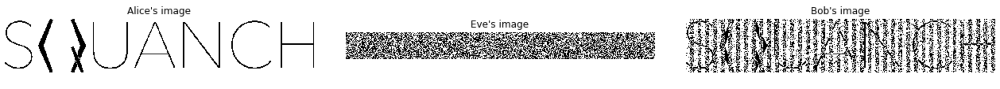

.. _manInTheMiddleDemo:

Man-In-The-Middle Attack
========================

This demonstration is a modified version of the :ref:`superdense coding <superdenseCodingDemo>` demonstration where we show how quantum networks can be resistant to interception attacks.

Protocol
--------

As in the superdense coding demo, Charlie will distribute Bell pairs to Alice and Bob, and Alice will attempt to send a classical message to Bob. However, a fourth party, Eve, will try to naiively intercept the message Alice sends to Bob. Eve will measure each qubit from Alice, record the result, and send the qubit to Bob. This scenario is illustrated below.

	1. Charlie generates EPR pairs in the state :math:`\frac{1}{\sqrt{2}} \left (\lvert 00 \rangle + \lvert 11 \rangle \right )`. He sends one particle to Alice and the other to Bob.

	2. Alice encodes her two bits of classical inforation in the relative sign and phase of her qubit by acting with the Pauli-X and -Z gates. Formally, if she has two bits, :math:`b_1 and b_2`, she applies X if :math:`b_2 = 1` and then applies Z if :math:`b_1 = 1`. She then sends the modified qubit to Bob, but it is intercepted by Eve first.

	3. Eve wants to know Alice's message, so she naiively measures each qubit she intercepts from Alice and records the result. She then sends the qubits to Bob, hoping he won't notice.

	4. Bob receives the qubit from Eve (who he thinks is Alice). He disentangles the X and Z components of the qubit by applying CNOT and H to Alice's qubit and Charlie's qubit. He then measures each of Alice's and Charlie's qubits to obtain :math:`b_1` and :math:`b_2`, respectively.

.. image:: ../img/man-in-the-middle-small.png

Implementation
--------------

First, let's import the modules we'll need.

.. code:: python

	from squanch import *
	import numpy as np
	import matplotlib.image as image
	import matplotlib.pyplot as plt

As before, we'll define the behavior of Alice, Bob, and Charlie. The only difference in their logic will be that Alice sends her qubit to Eve instead of Bob, and Bob receives his qubits from Eve instead of Alice.

.. code:: python

	class Alice(Agent):
		'''Alice sends information to Bob via superdense coding'''
		def run(self):
			for _ in self.stream:
				bit1 = self.data.pop(0)
				bit2 = self.data.pop(0)
				q = self.qrecv(charlie)
				if q is not None:
					if bit2 == 1: X(q)
					if bit1 == 1: Z(q)
				self.qsend(eve, q) # Alice unknowingly sends the qubit to Eve

	class Bob(Agent):
		'''Bob receives Alice's transmissions and reconstructs her information'''
		def run(self):
			bits = []
			for _ in self.stream:
				a = self.qrecv(eve) # Bob receives his qubit from Eve
				c = self.qrecv(charlie)
				if a is not None and c is not None:
					CNOT(a, c)
					H(a)
					bits.extend([a.measure(), c.measure()])
				else:
					bits.extend([0,0])
			self.output(bits)

	class Charlie(Agent):
		'''Charlie distributes Bell pairs between Alice and Bob.'''
		def run(self):
			for qsys in self.stream:
				a, b = qsys.qubits
				H(a)
				CNOT(a, b)
				self.qsend(alice, a)
				self.qsend(bob, b)

Now we'll add behavior for Eve to record and re-transmit Alice's qubits:

.. code:: python

	class Eve(Agent):
		'''Eve naively tries to intercept Alice's message'''
		def run(self):
			bits = []
			for _ in self.stream:
				a = self.qrecv(alice)
				if a is not None:
					bits.append(a.measure())
				else:
					bits.append(0)
				self.qsend(bob, a)
				self.increment_progress()
			self.output(bits)

Next, we'll load an image and convert it to black and white and flatten it into a bitstream using some helper functions (see the corresponding Jupyter notebook in `demos` for details). We'll allocate memory for an appropriately large `QStream` and make a shared output dictionary to allow the agents to return data.

.. code:: python

	# Load an image and serialize it to a bitstream
	img = image_to_black_and_white("../docs/source/img/squanchLogo.jpg")
	bitstream = list(img.flatten())

	# Allocate a shared Hilbert space and output object to pass to agents
	mem = Agent.shared_hilbert_space(2, int(len(bitstream) / 2))
	out = Agent.shared_output()

	# Make agent instances
	alice = Alice(mem, out, data = bitstream)
	bob = Bob(mem, out)
	charlie = Charlie(mem, out)
	eve = Eve(mem, out)

Like in the superdense coding demonstration, we'll connect the agents with fiber optic lines to simulate attenuation errors.

.. code:: python

	# Connect the agents over simulated fiber optic lines
	alice.qconnect(bob, FiberOpticQChannel, length=1.0)
	alice.qconnect(eve, FiberOpticQChannel, length=0.5)
	alice.qconnect(charlie, FiberOpticQChannel, length=0.5)
	bob.qconnect(charlie, FiberOpticQChannel, length=0.5)
	bob.qconnect(eve, FiberOpticQChannel, length=0.5)

Finally, we just need to make a simulation, run it, and plot what each agent receives.

.. code:: python

	Simulation(alice, eve, bob, charlie).run()
	plot_alice_bob_eve_images(out["Eve"], out["Bob"])

Source code
-----------

The full source code for this demonstration is available in the demos directory of the SQUANCH repository.
