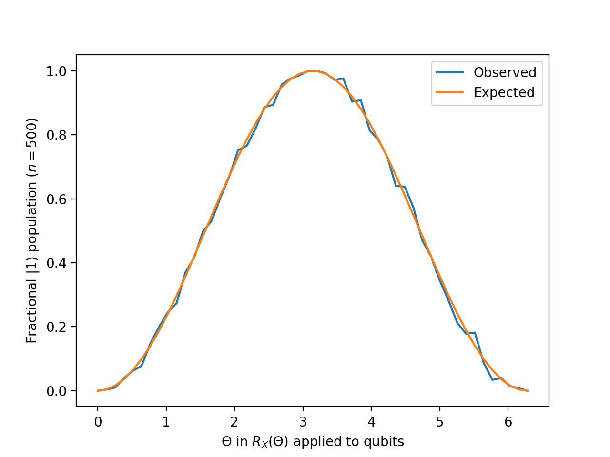

.. _teleportationDemo:

Quantum Teleportation
=====================

Quantum teleportation allows two parties that share an entangled pair to transfer an arbitrary quantum state using classical communication. This process has tremendous applicability to quantum networks, transferring fragile quantum states between distant nodes. Conecptually, quantum teleportation is the inverse of :ref:`superdense coding <superdenseCodingDemo>`.

The source code for this demo is included in the `demos` directory of the SQUANCH repository.

Protocol
--------

.. image:: https://www.media.mit.edu/quanta/qasm2circ/test2.png

Below is a simple two-party quantum teleportation protocol. We'll be using the above circuit diagram.

	1. Alice generates an EPR pair; for this protocol, we'll use the state :math:`\lvert q_1 q_2 \rangle = \frac{1}{\sqrt{2}} \left (\lvert 00 \rangle + \lvert 11 \rangle \right )`. She will keep one particle in the pair and send the other one to Bob.

	2. Alice entangles her qubit :math:`q_0` with her ancilla :math:`q_1` by applying controlled-not and Hadamard operators. 

	3. Alice measures both of her qubits and communicates the results (two bits) to Bob through a classical channel. Bob's qubit is now in one of four possible states, one of which is :math:`\lvert q_0 \rangle`. Bob will use Alice's two bits to determine what operations to apply to recover :math:`\lvert q_0 \rangle`.

	4. Bob applies a Pauli-X operator to his qubit if Alice's ancilla collapsed to :math:`\lvert q_1 \rangle = \lvert 1 \rangle`, and he applies a Pauli-Z operator to his qubit if her qubit collapsed to :math:`\lvert q_0 \rangle = \lvert 1 \rangle`. 

Implementation
--------------

Quantum teleportation is a simple protocol to implement in any quantum computing simulation framework, but SQUANCH's :ref:`Agent <agent>` and :ref:`Channel <channels>` modules provide an intuitive way to work with sending and receiving qubits, and the :ref:`QStream <qstream>` module allows you to create performant simulations of teleporting a large number of states in succession. 

First, let's import what we'll need.

.. code:: python

	import numpy as np
	import matplotlib.pyplot as plt
	from squanch import *

Now, we'll want to define the behavior of Alice and Bob. We'll extend the :ref:`Agent <agent>` class to create two child classes, and then we can change the `run()` method for each of them. For Alice, we'll want to include logic for creating an EPR pair and sending it to Bob, as well as the subsequent entanglement and measurement logic.

.. code:: python 

	class Alice(Agent):
		'''Alice sends qubits to Bob using a shared Bell pair'''

		def distribute_bell_pair(self, a, b):
			# Create a Bell pair and send one particle to Bob
			H(a)
			CNOT(a, b)
			self.qsend(bob, b)

		def teleport(self, q, a):
			# Perform the teleportation
			CNOT(q, a)
			H(q)
			# Tell Bob whether to apply Pauli-X and -Z over classical channel
			bob_should_apply_x = a.measure() # if Bob should apply X
			bob_should_apply_z = q.measure() # if Bob should apply Z
			self.csend(bob, [bob_should_apply_x, bob_should_apply_z])

		def run(self):
			for qsystem in self.stream:
				q, a, b = qsystem.qubits # q is state to teleport, a and b are Bell pair
				self.distribute_bell_pair(a, b)
				self.teleport(q, a)

Note that you can add arbitrary methods, such as `distribute_bellPair()` and `teleport()`, to agent child classes; just be careful not to overwrite any existing class methods other than `run()`.

For Bob, we'll want to include the logic to receive the particle from Alice and act on it according to Alice's measurement results.

.. code:: python

	class Bob(Agent):
		'''Bob receives qubits from Alice and measures the results'''

		def run(self):
			measurement_results = []
			for _ in self.stream:
				# Bob receives a qubit from Alice
				b = self.qrecv(alice)
				# Bob receives classical instructions from alice
				should_apply_x, should_apply_z = self.crecv(alice)
				if should_apply_x: X(b)
				if should_apply_z: Z(b)
				# Measure the output state
				measurement_results.append(b.measure())
			# Put results in output object
			self.output(measurement_results)

Now we want to prepare a set of states for Alice to teleport to Bob. Since each trial requires a set of three qubits, we'll allocate space for a :math:`3 \times 10` `QStream`. We'll also create a shared output dictionary to allow agents to communicate between processes. Explicitly allocating and passing memory to agents is necessary because each agent spawns and runs in a separate process, which (generally) have separate memory pools. (See :ref:`Agent <agent>` API for more details.)

.. code:: python

	# Allocate memory and output structures
	mem = Agent.shared_hilbert_space(3, 10) # 3 qubits per trial, 10 trials
	out = Agent.shared_output()

	# Prepare the initial states
	stream = QStream.from_array(mem)
	states_to_teleport = [1, 0, 1, 0, 1, 0, 1, 0, 1, 0]
	for state, qsystem in zip(states_to_teleport, stream):
		q = qsystem.qubit(0)
		if state == 1: X(q) # flip the qubits corresponding to 1 states

For agents to communicate with each other, they must be connected via quantum or classical channels. The `Agent.qconnect` and `Agent.cconnect` methods add a bidirectional quantum or classical channel, repsectively, to two agent instances and take a channel model and kwargs as optional arguments. In this example, we won't worry about a channel model and will just use the default QChannel and CChannel options. Let's create instances for Alice and Bob and connect them appropriately

.. code:: python

	# Make and connect the agents
	alice = Alice(mem)
	bob = Bob(mem, out)
	alice.qconnect(bob) # add a quantum channel
	alice.cconnect(bob) # add a classical channel

Finally, we call `agent.start()` for each agent to signal the process to start running, and `agent.join()` to wait for all agents to finish before proceeding in the program.

.. code:: python

	# Run everything
	alice.start(); bob.start()
	alice.join(); bob.join()

	print("Teleported states {}".format(states_to_teleport))
	print("Received states   {}".format(out["Bob"]))

Running what we have so far produces the following output:

.. parsed-literal:: 

	Teleported states [1, 0, 1, 0, 1, 0, 1, 0, 1, 0] 
	Received states   [1, 0, 1, 0, 1, 0, 1, 0, 1, 0]

So at least for the simple cases, our implementation seems to be working! Let's do a little more complex test case now. 

We'll now try teleporting an ensemble of identical states :math:`R_{X}(\theta) \lvert 0 \rangle` for several values of :math:`\theta`. We'll then measure each teleported state and see how it compares with the expected outcome.

.. code:: python

	angles = np.linspace(0, 2 * np.pi, 50)  # RX angles to apply
	num_trials = 250  # number of trials for each angle

	# Allocate memory and output structures
	mem = Agent.shared_hilbert_space(3, len(angles) * num_trials)
	out = Agent.shared_output()

	# Prepare the initial states in the stream
	stream = QStream.from_array(mem)
	for angle in angles:
		for _ in range(num_trials):
			q, _, _ = stream.next().qubits
			RX(q, angle)

	# Make the agents and connect with quantum and classical channels
	alice = Alice(mem, out = out)
	bob = Bob(mem, out = out)
	alice.qconnect(bob)
	alice.cconnect(bob)

	# Run the simulation
	Simulation(alice, bob).run()

	# Plot the results
	results = np.array(out["Bob"]).reshape((len(angles), num_trials))
	observed = np.mean(results, axis = 1)
	expected = np.sin(angles / 2) ** 2
	plt.plot(angles, observed, label = 'Observed')
	plt.plot(angles, expected, label = 'Expected')
	plt.legend()
	plt.xlabel("$\Theta$ in $R_X(\Theta)$ applied to qubits")
	plt.ylabel("Fractional $\left | 1 \\right >$ population")
	plt.show()

This gives us the following pretty plot.

Source code
-----------

The full source code for this demonstration is available in the demos directory of the SQUANCH repository.
