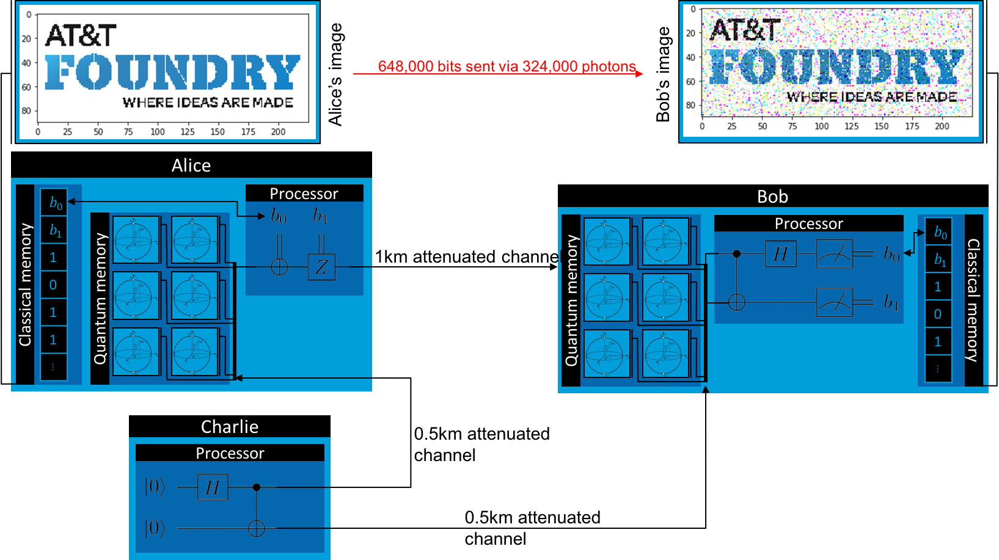

.. _superdenseCodingDemo:

Superdense Coding
=================

Superdense coding is a process whereby two parties connected via a quantum channel and sharing an entangled pair can send two classical bits of information using only a single qubit. Conceptually, superdense coding is the inverse of :ref:`quantum teleportation <teleportationDemo>`.

In this demonstration, we'll implement the three-party superdense coding protocol depicted in the circuit diagram shown below. Charlie distributes entangled particles to Alice and Bob. Alice encodes her information in her particles and sends them to Bob, who decodes the information by matching Alice’s qubits with his half of the shared state received from Charlie.

For this demonstration, Alice will send data to Bob in the form of a serialized bitstream representing an image. We'll use the built-in timing functionality to track the simulated time for each agent to complete their part of the protocol. Since superdense coding could be used as a networking protocol in the foreseeable future, even very rudimentary simulated timing data could be useful to quantify the performance of the algorithm, especially if data validation and error correction through multiple transmission attempts is simulated. We assume a photon pulse interval of 1ns and a spatial separation between Alice and Bob of 1km, with Charlie at the midpoint. All agents are connected with the ``FiberOpticQChannel`` model, which simulates 0.16 dB/km attenuation errors by randomly changing transmitted qubits to ``None``. Any dropped qubits lost to attenuation will have their bits replaced with 0.

Protocol
--------

.. image:: ../img/superdense-circuit.png

We'll be using the above circuit diagram to describe a three-party quantum superdense coding protocol. There are three agents: Charlie distributes entangled particles to Alice and Bob, Alice encodes her information in her particles and sends them to Bob, who decodes the information by matching Alice's qubits with his own qubits received from Charlie.

	1. Charlie generates EPR pairs in the state :math:`\frac{1}{\sqrt{2}} \left (\lvert 00 \rangle + \lvert 11 \rangle \right )`. He sends one particle to Alice and the other to Bob.

	2. Alice encodes her two bits of classical inforation in the relative sign and phase of her qubit by acting with the Pauli-X and -Z gates. Formally, if she has two bits, :math:`b_1` and :math:`b_2`, she applies X if :math:`b_2 = 1` and then applies Z if :math:`b_1 = 1`. She then sends the modified qubit to Bob.

	3. Bob disentangles the X and Z components of the qubit by applying CNOT and H to Alice's qubit and Charlie's qubit. He then measures each of Alice's and Charlie's qubits to obtain :math:`b_1` and :math:`b_2`, respectively.

We'll also use SQUANCH's built-in timing functionality to track the simulated time for each agent to complete their part of the protocol assuming a photon pulse interval of 1ns.

Implementation
--------------

Because superdense coding transmits classical information through quantum channels, it makes for a good protocol to visually demonstrate both the tranmission of the information and some of SQUANCH's simulated errors. (This also makes it a good demonstration for implementing classical and quantum error corrections, although we won't do that in this demo.) The protocol we'll be implementing looks like this at a conceptual level:

First, let's import the modules we'll need.

.. code:: python

	import numpy as np
	import time 
	import matplotlib.image as image
	import matplotlib.pyplot as plt
	from squanch import *

Now, as usual, we'll want to define child `Agent` classes that implement the behavior we want. For Charlie, we'll want to include the behavior to make an EPR pair and distribute it to Alice and Bob.

.. code:: python

	class Charlie(Agent):
		'''Charlie distributes Bell pairs between Alice and Bob.'''
		def run(self):
			for qsys in self.qstream:
				a, b = qsys.qubits
				H(a)
				CNOT(a, b)
				self.qsend(alice, a)
				self.qsend(bob, b)
            self.output({"t": self.time})

For Alice, we'll want to include the transmission behavior. We'll pass in the data that she wants to transmit as a 1D array in an input argument when we instantiate her, and it will be stored in `self.data`. 

.. code:: python

	class Alice(Agent):
		'''Alice sends information to Bob via superdense coding'''
		def run(self):
			for _ in self.qstream:
				bit1 = self.data.pop(0)
				bit2 = self.data.pop(0)
				q = self.qrecv(charlie)
				if q is not None: # qubit could be lost due to attenuation errors
					if bit2 == 1: X(q)
					if bit1 == 1: Z(q)
				self.qsend(bob, q)
            self.output({"t": self.time})

Finally, for Bob, we'll want to include the disentangling and measurement behavior, and we'll want to output his measured data using `self.output`, which passes it to the parent process through the `shared_output` that is provided to agents on instantiation.

.. code:: python

	class Bob(Agent):
		'''Bob receives Alice's transmissions and reconstructs her information'''
		def run(self):
			bits = []
			for _ in self.qstream:
				a = self.qrecv(alice)
				c = self.qrecv(charlie)
				if a is not None and c is not None:
					CNOT(a, c)
					H(a)
					bits.extend([a.measure(), c.measure()])
				else:
					bits.extend([0,0])
            self.output({"t": self.time, "bits": bits})

Now, we want to instantiate Alice, Bob, and Charlie, and run the protocol. To do this, we'll need to pass in the data that Alice will send to Bob (which will be an image serialized to a 1D array of bits) using the `data` keyword argument, and we'll need to provide the agents with the `QStream` they will work on. If we want to get anything from the agents after their processes have finished, we'll also need to pass as an output structure to push their data to. (This is necessary because all agents run in separate processes, so explicitly shared output dictionaries must be passed to them.)

.. code:: python 

    # Load an image and serialize it to a bitstream
    img = image.imread("../docs/source/img/foundryLogo.bmp")
    bitstream = list(np.unpackbits(img))

    # Initialize the qstream
    qstream = QStream(2, int(len(bitstream) / 2))

    # Make agent instances
    out = Agent.shared_output()
    alice = Alice(qstream, out, data = bitstream)
    bob = Bob(qstream, out)
    charlie = Charlie(qstream, out)

    # Set photon transmission rate
    alice.pulse_length = 1e-9
    bob.pulse_length = 1e-9
    charlie.pulse_length = 1e-9

For agents to communicate with each other, they must be connected via quantum or classical channels. The `Agent.qconnect` and `Agent.cconnect` methods add a bidirectional quantum or classical channel, repsectively, to two agent instances and take as arguments a channel model and associated keyword arguments. SQUANCH includes several built-in rudimentary channel models, including a fiber optic cable model which simulates attenuation errors. (For more on channel and error models, see the :ref:`quantum error correction demo <quantumErrorCorrectionDemo>`.) Let's say that Alice and Bob are separated by a 1km fiber optic cable, and Charlie is at the midpoint, 0.5km away from each.

.. code:: python 

	# Connect the agents with simulated fiber optic lines; see squanch.channels module
	alice.qconnect(bob, FiberOpticQChannel, length=1.0)
	charlie.qconnect(alice, FiberOpticQChannel, length=0.5)
	charlie.qconnect(bob, FiberOpticQChannel, length=0.5)

Once we've connected the agents, we just need to run all of the agent processes with `start()` and wait for them to finish with `join()`.

.. code:: python

	# Run the agents
    start = time.time()
    Simulation(alice, bob, charlie).run()

    print("Transmitted {} bits in {:.3f}s.".format(len(out["Bob"]), time.time() - start))
    t_alice, t_bob, t_charlie = out["Alice"]["t"], out["Bob"]["t"], out["Charlie"]["t"]
    print("Simulated time: Alice: {:.2e}s, Bob: {:.2e}s, Charlie: {:.2e}s"
          .format(t_alice, t_bob, t_charlie))

.. parsed-literal::

    Transmitted 2 bits in 74.323s.
    Simulated time: Alice: 4.16e-04s, Bob: 4.20e-04s, Charlie: 4.15e-04s

Finally, let's retrieve Bob's data and repackage it into an image array, then compare the results.

.. code:: python

    received = np.reshape(np.packbits(out["Bob"]["bits"]), img.shape)
    f, ax = plt.subplots(1, 2, figsize = (8, 4))
    ax[0].imshow(img)
    ax[0].axis('off')
    ax[0].title.set_text("Alice's image")
    ax[1].imshow(received)
    ax[1].axis('off')
    ax[1].title.set_text("Bob's image")
    plt.tight_layout()
    plt.show()

.. image:: ../img/transmissionDemo.png 

Source code
-----------

The full source code for this demonstration is available in the demos directory of the SQUANCH repository.
