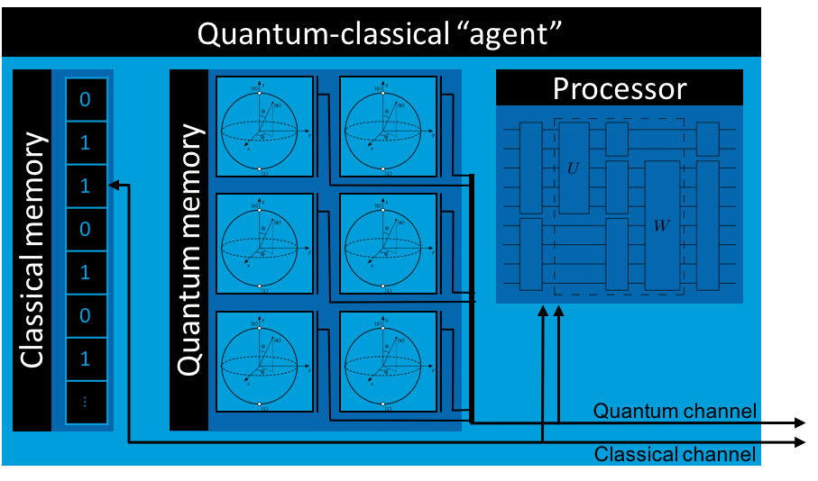
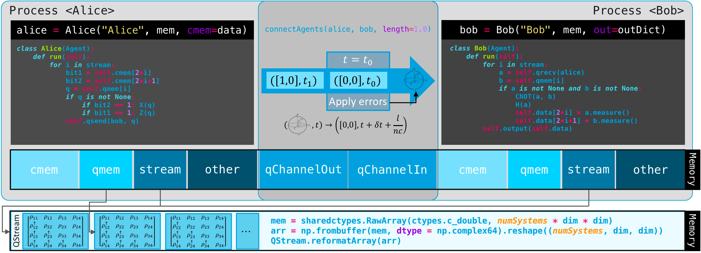

Overview
========

A Simulator for Quantum Networks and Channels
---------------------------------------------

SQUANCH (Simulator for QUAntum Networks and CHannels) is an open-source Python framework for creating performant simulations of quantum information processing and transmission. Although it can be used as a general-purpose quantum computing simulation library, SQUANCH is designed for simulating quantum *networks*, acting as a sort of simulated quantum playground for you to test ideas for quantum transmission and networking protocols. For this purpose, it includes a number of extensible and flexible modules that allow you to intuitively design a quantum network, a range of built-in quantum error simulations to introduce realism and the need for error corrections in your simulations, and lightweight and easily parallelizable systems for manipulating quantum information that allow it to vastly outperform (by a factor of as much as 1000) other frameworks in certain tasks.

SQUANCH is developed as part of the Intelligent Quantum Networks and Technologies (INQNET) initiative, a collaboration between AT&T and the California Institute of Technology. The source is hosted on GitHub (INSERT LINK ONCE WE HAVE NEW REPO).

Design Overview
---------------

.. image:: img/moduleOverview.png

Information Representation and Processing
^^^^^^^^^^^^^^^^^^^^^^^^^^^^^^^^^^^^^^^^^

The fundamental unit of information in SQUANCH is the :ref:`QSystem <qubit>`, which represents the quantum state of a multi-particle entangled system as a complex-valued density matrix. A :ref:`QStream <qstream>` represents a collection of disjoint (mutually unentangled) quantum systems, such as a collection of millions of EPR pairs. ``QSystem`` s are lightweight, and can be instantiated by reference from a portion of an existing array (typically from a ``QStream``), which vastly improves the cache locality and performance of operations on sequential quantum systems (such as encoding a stream of classical information on qubits using :ref:`superdense coding <superdenseCodingDemo>`).

SQUANCH users will interact most frequently with the lightweight wrapper :ref:`Qubit <qubit>` class, which mirrors the methods of ``QSystem`` to more intuitively manipulate the states of quantum systems. ``Qubits`` have very little internal information, maintaining only a reference to their parent system and a qubit index.

The :ref:`Gates <gates>` module provides a number of built-in quantum gates to manipulate qubits. Under the hood, it has a number of caching functions that remember previously-used operators to avoid repeating expensive tensor calculations, and it is easily extensible to define custom operators. 

Agents and Channels
^^^^^^^^^^^^^^^^^^^

The top-level modules that provide the greatest abstraction are :ref:`Agents <agent>` and :ref:`Channels <channels>`, which implement the nodes and connections in a quantum network, repsectively. An ``Agent`` generalizes the notion of an actor (Alice, Bob, etc.) that can manipulate, send, receive, and store classical and quantum information. Agents have internal clocks, classical and quantum memories, classical and quantum incoming and outgoing channels that can connect to other agents, and a processor in the form of a ``run()`` function that implements runtime logic. 

In simulations, agents run in parallel from separate processes, synchronizing clocks and passing information between each other with classical and quantum channels. Channels are effectively wrappers for multiprocessed queues that track transmission times and speed of light delays and simulate errors on transmitted qubits, which are passed by a serialized reference.

Memory Structure and Time Synchronization
^^^^^^^^^^^^^^^^^^^^^^^^^^^^^^^^^^^^^^^^^

For optimal performance and for conceptual realism, agents (nodes in a network) run concurrently in separate processes that can only communicate by sending information through channels. Since separate processes normally have separate memory pools, this requires an interesting memory structure, since two agents running in separate processes must manipulate the same set of matrices in memory that represent the non-local combined quantum state shared between agents. In other words, if Alice and Bob share an entangled pair, Alice's particle needs to be aware of the measurements performed on Bob's particle.

This is solved in SQUANCH by explicitly allocating an appropriately sized block of shared memory using the ``sharedHilbertSpace()`` function in the ``QStream`` module. This creates a 1D array of c-type doubles (which have the same size as the ``numpy.complex64`` values that are used to express density matrices in SQUANCH), which is casted and reshaped to a 3D complex-valued numpy array. Agents can then instantiate separate ``QStream`` s that all point to the same physical memory location to represent their state. Since ``Qubit`` objects must be serialized to pass through Python's multiprocessing queues, channels serialized qubits to their (system, qubit) indices and reinstance the qubit for the receiving agent, insuring that they reference the correct location in memory. 

SQUANCH includes rudimentary built-in timing features for agents to allow users to characterize the efficiency of protocols, taking specified values of photon pulse widths, signal travel speeds, length of channels, etc. into account. Agents maintain separate clocks which are synchronized upon exchanging dependent information. For example, suppose Alice and Bob are sparated by 300m, and Alice transfers :math:`10^5` qubits with a 10ps pulse width to Bob. Alice's clock at the beginning of the transmission is :math:`1.5 \mu s`, and Bob's clock is :math:`2.0 \mu s`. After the transmission, Alice's clock reads :math:`1.5 + 10^5 \cdot 10^{-5} = 2.5 \mu s`, and Bob's accounts for a speed of light delay to update to :math:`2.0 + 10^5 \cdot 10^{-5} + \frac{300m}{c} = 4 \mu s`.

A conceptual diagram of the memory structure and time synchronization protocol for two agents simulating information transfer via :ref:`superdense coding <superdenseCodingDemo>` is shown below.

